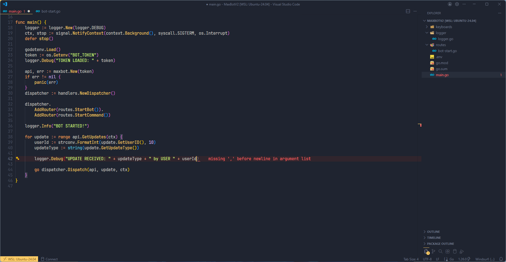

# VS Code Minimal Vim Setup



A minimal Visual Studio Code configuration with **vim-like keybindings** and a distraction-free UI.

Designed for fast navigation, efficient editing.

---

## ✨ Features

- Minimalistic UI
- Vim-inspired keybindings (hjkl navigation, terminal control, etc.)
- Clean color scheme and readable syntax highlighting

---

## 📦 Required Extensions

Make sure to install the following extensions:

- Macros  
  https://marketplace.visualstudio.com/items?itemName=geddski.macros
- Ayu Theme  
  https://marketplace.visualstudio.com/items?itemName=teabyii.ayu
- Better Comments  
  https://marketplace.visualstudio.com/items?itemName=aaron-bond.better-comments
- Error Lens  
  https://marketplace.visualstudio.com/items?itemName=usernamehw.errorlens
- VSCode Icons  
  https://marketplace.visualstudio.com/items?itemName=vscode-icons-team.vscode-icons

---

## 🚀 Installation

1. Clone this repository:

```bash
git clone https://github.com/DurnevVS/.vscode.git
```

2. Copy settings into your VS Code config directory:

Linux:
~/.config/Code/User/

Windows:
%APPDATA%\Code\User\

macOS:
~/Library/Application Support/Code/User/

3. Add extensions.
4. Restart VS Code
